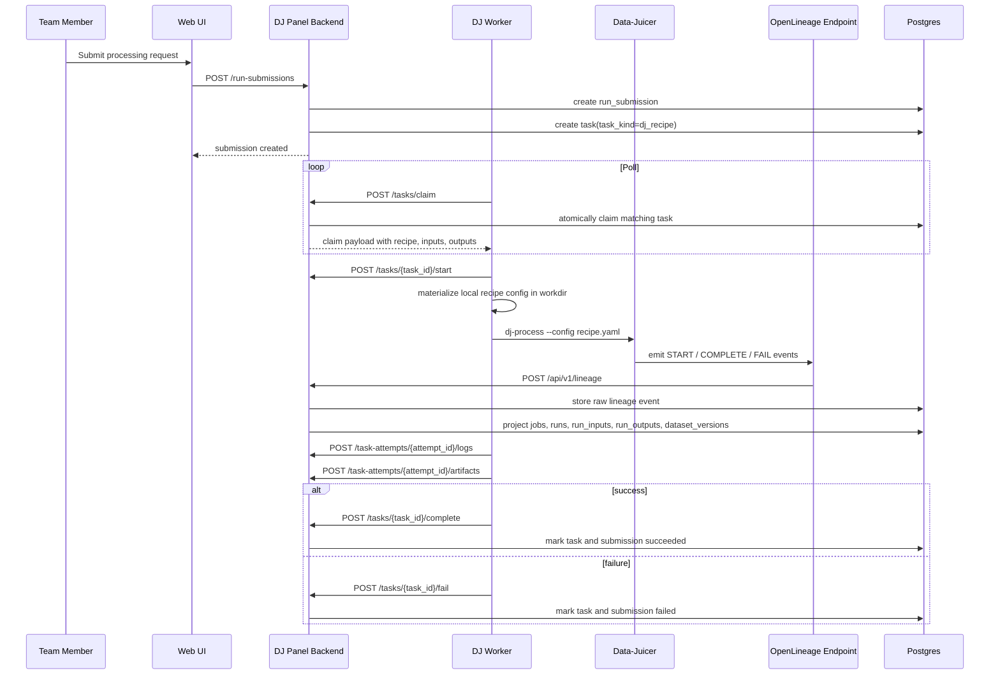

# DJ Worker Claim Payload and Sequence

## 1. Purpose

This document defines the preferred V1 worker contract for Data-Juicer processing.

The goal is:

- the backend sends structured DJ execution intent
- the worker materializes a runnable Data-Juicer config
- the worker runs `dj-process --config ...`
- OpenLineage events are emitted by the Data-Juicer plugin automatically

## 2. Worker Startup Shape

Recommended command:

```bash
dj-panel worker dj \
  --workspace llm-team \
  --worker-id dj-node-01 \
  --base-url http://127.0.0.1:8000 \
  --workdir /tmp/dj-panel-worker \
  --dj-bin dj-process \
  --poll-interval 5
```

Argument meaning:

- `workspace`
  The workspace queue this worker participates in.
- `worker-id`
  Stable worker identity.
- `base-url`
  Backend API root.
- `workdir`
  Local scratch space for task-local files.
- `dj-bin`
  Data-Juicer executable in the current environment.
- `poll-interval`
  Poll interval in seconds.

## 3. Claim Request

`POST /api/v1/workspaces/{workspace_slug}/tasks/claim`

Request:

```json
{
  "workerId": "dj-node-01",
  "supportedTaskKinds": [
    "dj_recipe"
  ]
}
```

## 4. Claim Response Payload

Recommended full payload:

```json
{
  "claimed": true,
  "task": {
    "taskId": "task-uuid",
    "attemptId": "attempt-uuid",
    "leaseToken": "lease-token",
    "taskKind": "dj_recipe",
    "timeoutSeconds": 7200,
    "submission": {
      "id": "submission-uuid",
      "workspaceSlug": "llm-team",
      "requestedBy": "alice",
      "submissionKind": "processing_pipeline",
      "parameters": {
        "sample_size": 100000
      }
    },
    "recipeVersion": {
      "id": "recipe-version-uuid",
      "recipeId": "recipe-uuid",
      "recipeName": "sft-cleaning",
      "version": 8,
      "rawYaml": "project_name: clean_sft\n...",
      "recipeHash": "sha256:...",
      "projectName": "clean_sft",
      "executorType": "standalone",
      "djVersion": "1.4.6",
      "pipelineJobNamespace": "llm-team.processing",
      "pipelineJobName": "sft-cleaning"
    },
    "inputs": [
      {
        "datasetVersionId": "dataset-version-uuid",
        "namespace": "llm-team.datasets",
        "name": "raw_sft",
        "version": "2026-04-25",
        "storageUri": "s3://bucket/raw_sft/2026-04-25",
        "role": "primary_input"
      }
    ],
    "outputs": [
      {
        "datasetNamespace": "llm-team.datasets",
        "datasetName": "clean_sft",
        "declaredVersion": "auto",
        "storageUri": "s3://bucket/clean_sft/next",
        "role": "primary_output"
      }
    ],
    "runtime": {
      "workdir": "/tmp/dj-panel-worker/tasks/task-uuid",
      "envVars": {
        "OPENLINEAGE_URL": "http://127.0.0.1:8000/api/v1/lineage"
      },
      "overrides": {
        "sample_size": 100000
      }
    },
    "executionSpec": {
      "executor": "dj-process",
      "configMode": "materialize_local_config"
    }
  }
}
```

## 5. Worker Execution Rules

After claiming, the worker should:

1. create the local task work directory
2. write `recipeVersion.rawYaml` to a local file
3. inject input dataset locations from `inputs[].storageUri`
4. inject output target locations from `outputs[].storageUri`
5. apply `runtime.overrides`
6. prepare environment variables
7. invoke:

```bash
dj-process --config /tmp/dj-panel-worker/tasks/task-uuid/recipe.yaml
```

8. stream logs back to the backend
9. complete or fail the task

The worker should not need a worker-global datasets root. Dataset location comes from dataset records carried in the payload.

## 6. Example Local Materialization

Example local files:

```text
/tmp/dj-panel-worker/tasks/task-uuid/
  recipe.yaml
  stdout.log
  stderr.log
```

Example materialized config result:

- original recipe YAML
- input dataset paths resolved
- output export path resolved
- runtime parameters injected

## 7. Sequence Diagram



## 8. State Transition Summary

### Submission

- `PENDING`
- `DISPATCHED`
- `RUNNING`
- `SUCCEEDED`
- `FAILED`
- `CANCELLED`

### Task

- `PENDING`
- `CLAIMED`
- `RUNNING`
- `SUCCEEDED`
- `FAILED`
- `CANCELLED`

### Observed Run

- `START`
- `COMPLETE`
- `FAIL`

## 9. Correlation Model

Recommended correlation rules:

- one V1 submission usually maps to one primary pipeline run
- one task attempt may also correlate to many operator-level runs
- one task attempt should store one primary `openlineage_run_id` when known
- the backend should also support a mapping table from task attempts to observed runs

## 10. Why This Contract Fits V1

This worker contract is a good fit for the first Data-Juicer-only version because:

- it follows the real DJ CLI shape
- it keeps dataset location management in dataset records
- it keeps workers simple and specialized
- it lets OpenLineage remain the runtime fact source
